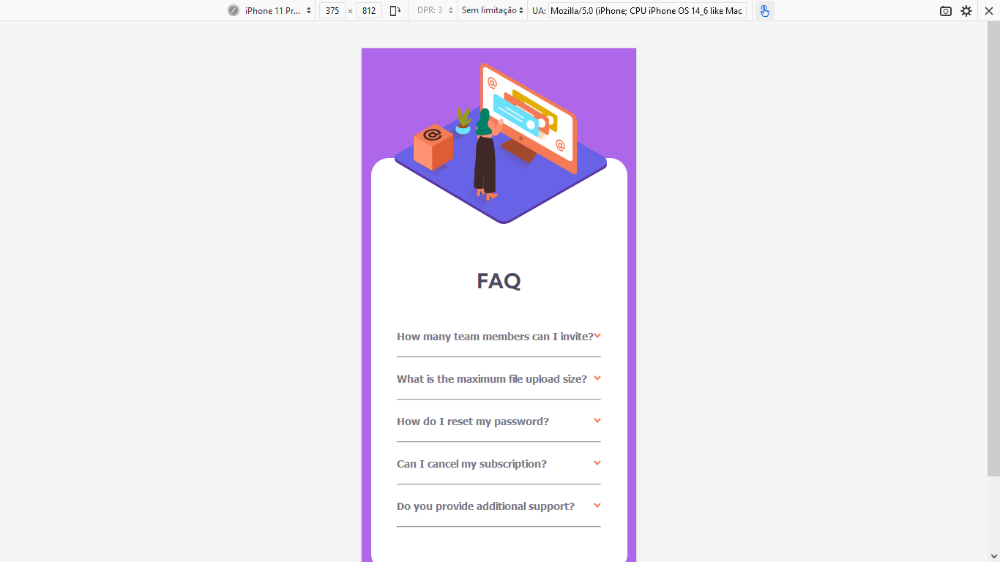
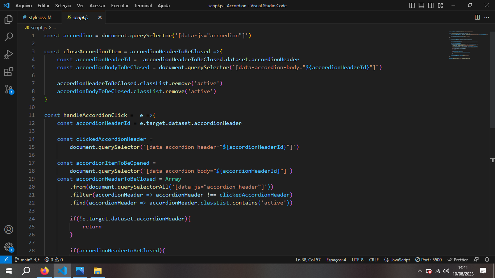

<h1>FAQ Accordion Frontend Mentor</h1>
 

Desafio realizado para Frontend Mentor! HTML, CSS e JS Vanilla.

 
<h2>Layout Desktop</h2>
 

 
<h2>Layout Desktop Hover </h2>
 

 
<h2>Layout Desktop FAQ Ativo</h2>
 

 
<h2>Layout Desktop FAQ Ativo Outro Item</h2>
 

 
<h2>Layout Mobile</h2>
 

 
<h2>Layout Mobile FAQ Ativo</h2>
 

 
<h2>Detalhe JavaScript </h2>
 

 
<h2>Realizei JS antes do CSS </h2>
 

 
<h3>Sobre o projeto</h3>
 

Este desafio foi bem legal de se resolver. Não tive dificuldades com o HTML ou o CSS, responsividade ficou bem legal e fácil de resolver. Só preciso me atentar a começar a usar mais imagens no Background-images e não usar tanta tag img e ficar arrumando em position depois.  
Já a parte do JS, eu realizei a resolução com a ajuda do tutorial do video de FAQ Accordion do Roger MEllo, no Youtube. Roger melo é focado em JS Vanilla e tem didática muito boa.
 